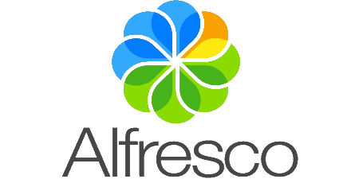

  </img>

Yeoman Generator Angular 2 Alfresco Component

# [1.0.0](https://github.com/Alfresco/generator-ng2-alfresco-component/releases) (19-12-2016)
## fix
- [App generation fails when no email provided  #35](https://github.com/Alfresco/alfresco-js-api/pull/35)

## Features
- [Update generator to last version ADF 1.0 support UMD Bundle  #38](https://github.com/Alfresco/alfresco-js-api/issues/38)
