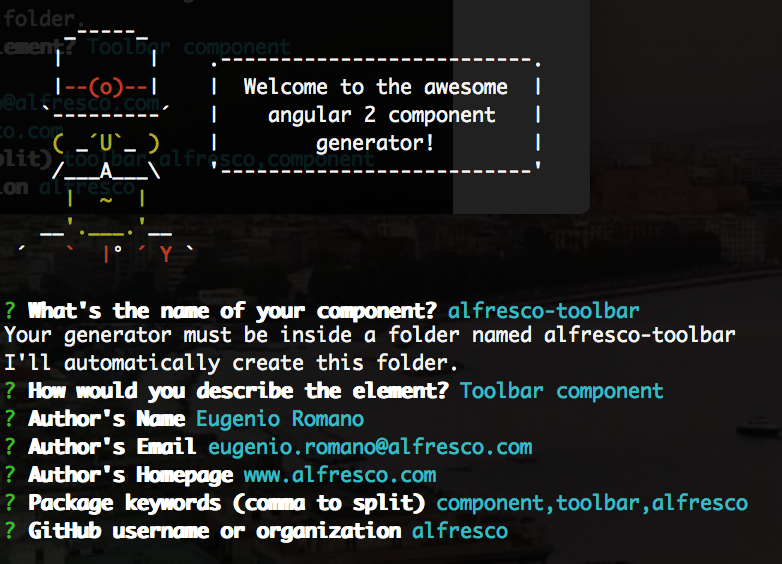

<h1 align="center">Yeoman Generator Angular 2 Alfresco Component</h1>
<p align="center">
  
</p>
<p align="center">
  <a title='Build Status' href="https://travis-ci.org/Alfresco/generator-ng2-alfresco-component">
    
  </a>
  <a href='https://coveralls.io/github/Alfresco/generator-ng2-alfresco-component?branch=master'>
    
  </a>
  <a href='https://github.com/Alfresco/generator-ng2-alfresco-component/blob/master/LICENSE'>
    
  </a>
  <a alt='downloads stats' href='https://npmjs.org/package/generator-ng2-alfresco-component'>
    
  </a>
  <a href="https://nodei.co/npm/generator-ng2-alfresco-component/">
    
  </a>
</p>

>Yeoman generator generating a Angular2 Alfresco Component scaffold

## Introduction

See the following [page](https://github.com/Alfresco/app-dev-framework/blob/master/INTRODUCTION.md) for an introduction to the Alfresco Application Development Framework. 

## Prerequisites

Before you start using this development framework and the generator, make sure you have installed all required software and done all the 
necessary configuration, see this [page](https://github.com/Alfresco/app-dev-framework/blob/master/PREREQUISITES.md).

## Installing Yeoman and the Component Generator

First, install [Yeoman](http://yeoman.io):

```sh
$ npm install -g yo
```

Then the Alfresco Component Generator:
 
```sh
$ npm install -g generator-ng2-alfresco-component
```
 
##  Generating a new component project

First, move into the folder where you want create your component.

```sh
yo ng2-alfresco-component
```



Which will generate the following project structure and run `npm install` for you to fetch all dependencies:


    ├── .editorconfig
    ├── .gitignore
    ├── tsconfig.json
    ├── tslint.json
    ├── package.json
    ├── typings.json
    ├── karma.conf.js
    ├── karma-test-shim.js
    ├── LICENSE
    ├── README.md
    ├── my-element.ts
    ├── assets/license_header.txt
    ├── demo/.gitignore
    ├── demo/.editorconfig
    ├── demo/package.json
    ├── demo/tsconfig.json
    ├── demo/tslint.json
    ├── demo/typings.json
    ├── demo/README.html
    ├── demo/index.html
    ├── demo/app/main.ts
    ├── demo/browser-sync-config.js
    ├── src/my-element-tests.component.ts
    └── src/my-element.component.ts

## Generated component commands


* To test your component

    ```sh
    $ npm run test
    ```
    
* To run the test in the browser

    ```sh
    $ npm run test-browser
    ```    

* To run the test coverage

    ```sh
    $ npm run coverage
    ```
        
* To build the component

    ```sh
    $ npm run build
    ```
    
* To build the component and keep watching the changes

    ```sh
    $ npm run build:w
    ```

* To provide a live demo

    ```sh
    $ cd demo
    $ npm run start
    ```
    
## Contributing to the generator

1. Fork it!
2. Create your feature branch: `git checkout -b my-new-feature`
3. Commit your changes: `git commit -m 'Add some feature'`
4. Push to the branch: `git push origin my-new-feature`
5. Submit a pull request

>To contribute to the existing code base add test cases to cover the new behaviour, and make sure all the existing tests are still green.

* To test the generator 

    ```sh
    $ npm run test
    ```

## History

For detailed changelog, see [Releases](https://github.com/Alfresco/generator-ng2-alfresco-component/releases).

## Contributors

Contributor | GitHub profile | Twitter profile |
--- | --- | ---
Eugenio Romano (contributor)| [Eugenio Romano](https://github.com/eromano) | [@RomanoEugenio](https://twitter.com/RomanoEugenio)

All contributors [contributors](https://github.com/alfresco/generator-ng2-alfresco-component/graphs/contributors).

## License
[MIT](https://github.com/alfresco/generator-ng2-alfresco-component/blob/master/LICENSE)
 
 * 2016-06-30  v0.0.24 Fix readme
 * 2016-06-30  v0.0.23 Angular RC3
 * 2016-06-17  v0.0.19 Angular RC2
 * 2016-06-03  v0.0.18 Angular Beta  
